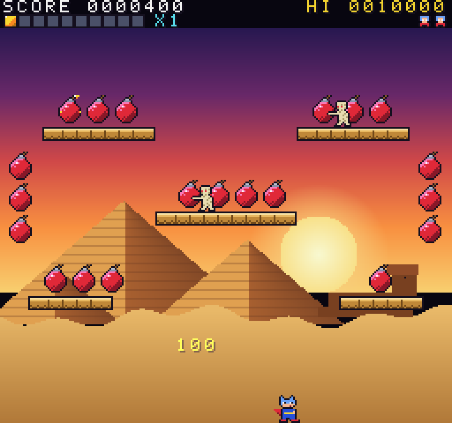

# Bomb Jack Go

A Bomb Jack–style arcade platformer written in Go with [Ebitengine](https://ebitengine.org),
inspired by Tehkan's 1984 arcade classic. Jack leaps and floats around four screens collecting
24 bombs per round, while mummies, birds, saucers and orbs hunt him down.



## Features

- **6 levels:** Egypt, Greece, Castle, City, Volcano and Iceland. After Iceland they loop with higher difficulty. Volcano has smoke billowing from its crater and embers rising from a lava pool, and Iceland has snow falling in two depths.
- **Classic mechanics:**
  - high jumps, and mid-air **float**
  - the **lit-bomb chain** with a round-end bonus. Bombs come in rows and columns that light one by one (rows left to right, columns top to bottom), so you can sweep a whole group in one run or one drop. Before the first pickup, the bomb that starts the chain flashes white as a hint.
  - a bonus meter that releases the **P** power ball, which turns enemies into coins
  - **B** (multiplier), **E** (extra life) and **S** (special) power-ups
- **Homing missiles:** you start each life with 3 and can hold up to 9; a missile crate (+3 missiles) drops in regularly. Each missile curves in on the closest enemy along a Bézier arc, wobbling and accelerating, with a huge cartoon smoke trail, and ends in a firework.
- **All graphics are generated in Go code** ([internal/art](internal/art)), with no image files:
  - 16-bit-style pixel-art sprites
  - smooth-gradient backdrops with parallax layers and drifting clouds
  - particle effects: cartoon bomb explosions with flares and steam, the mummy-transform "poof", and a sparkling title logo
  - a bitmap font
- **C64 SID-style music** ([internal/audio](internal/audio)). Every tune runs on a 3-voice SID-style engine using trademark chip tricks: PWM, 50 Hz arpeggio chords, the "fat" octave-arpeggio bass, resonant filter sweeps, drums stolen from melody voices, noise-attack instruments, portamento, vibrato, ring modulation and echo. There are original tunes for the title, all six levels and the high-score screen, plus procedural sound effects.
- **Top-5 high-score table** with 3-letter initials (arrows pick a letter, Z confirms, X goes back; after 30 seconds the letters on screen are saved), saved locally.
- **Menu and sound test:** pick a difficulty (Easy, Normal or Hard; all play the regular game for now) or open **Sound & FX** to play every tune and sound effect.
- **Runs in the browser** via a WebAssembly build.

## Controls

| Key | Action |
|---|---|
| ← → (or A / D) | Move |
| Z / Space / ↑ | Jump. Tap repeatedly in mid-air to **fly**: each tap gives a little lift, then gravity takes over |
| ↓ | Cancel float (drop faster) |
| X | Fire a **homing missile** at the closest enemy |
| Enter / Z | Title: open the menu (Easy / Normal / Hard / Sound & FX). In menus: arrows select, Enter or Z confirms |
| P / Esc | Pause. Esc again while paused quits to the title |
| M | Mute |
| I | Cheat: toggle invincibility |
| Esc | Menus and sound test: back to the title. Title screen: quit |

A standard gamepad also works.

## Build and run

Requirements: **Go 1.27+**.

- **macOS and Windows** need nothing else.
- **Linux** needs the usual Ebitengine dependencies:

```bash
sudo apt install gcc libc6-dev libgl1-mesa-dev libxcursor-dev libxi-dev libxinerama-dev libxrandr-dev libxxf86vm-dev libasound2-dev pkg-config
```

Run directly:

```bash
make run
```

Or build a binary into `bin/`:

```bash
make build
```

Then start it:

```bash
./bin/bombjack
```

Without `make`, use `go run ./cmd/bombjack`.

### Play in the browser (WebAssembly)

```bash
make serve
```

This builds `web/bombjack.wasm` and serves it locally. Then open <http://localhost:8080>.
The `web/` folder is static, so it can be hosted anywhere.

## Development

| Command | Purpose |
|---|---|
| `make test` | Run all unit tests. Game logic is headless and runs without a window |
| `make lint` | gofmt check + `go vet` |
| `make sprites` | Render all sprites/backgrounds to `assets/` plus an animated preview at `assets/preview/index.html` |
| `make shots ROUND=2 TICKS=300,900` | Autopilot run that saves screenshots to `shots/` (`ROUND=-1` title, `-2` menu, `-3` sound test, `0i` = round 0 with no input) |
| `make web` / `make serve` | Build or serve the WebAssembly version |
| `make music` | Render all music to WAV files in `music/` |

The design, architecture and the multi-agent implementation plan are in [PLAN.md](PLAN.md).
